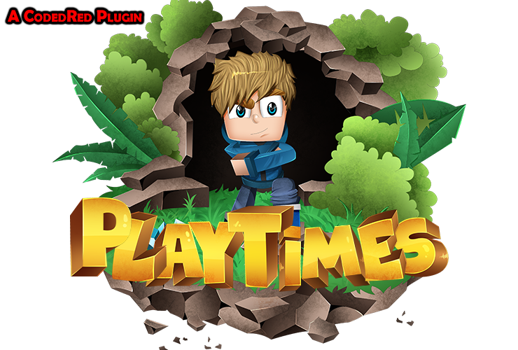

[![Downloads][downloads-shield]][downloads-url]
[![Bstatsp][bstatsp-shield]][bstatsp-url]
[![Bstatss][bstatss-shield]][bstatss-url]
[![Issues][issues-shield]][issues-url]
[![GNU License][license-shield]][license-url]

<!-- PROJECT LOGO -->
 

  

  <h3 align="center">PlayTimes</h3>

  

    The best /playtime plugin! PAPI support, offline checks, API & more!
     
    <a href="https://github.com/CodedRed-Spigot/PlayTimes/wiki"><strong>Explore the docs »</strong></a>
     
     
    <a href="https://www.spigotmc.org/resources/playtimes-check-players-playtime-server-uptime.58858/">View Demo</a>
    ·
    <a href="https://github.com/CodedRed-Spigot/PlayTimes/issues">Report Bug</a>
    ·
    <a href="https://github.com/CodedRed-Spigot/PlayTimes/issues">Request Feature</a>
  

<!-- TABLE OF CONTENTS -->

  
<h2 style="display: inline-block">Table of Contents</h2>

  <ol>
    <li>
      <a href="#about-the-project">About The Project</a>
    </li>
<!--    <li>
      <a href="#getting-started">Getting Started</a>
      <ul>
        <li><a href="#prerequisites">Prerequisites</a></li>
        <li><a href="#installation">Installation</a></li>
      </ul>
    </li> -->
    <li><a href="#usage">Usage</a></li>
    <li><a href="#roadmap">Roadmap</a></li>
    <li><a href="#contributing">Contributing</a></li>
    <li><a href="#license">License</a></li>
    <li><a href="#contact">Contact</a></li>
  </ol>

<!-- ABOUT THE PROJECT -->
## About The Project

PlayTimes is the perfect plugin for your server! Have players show off and compete for more time played with playtime's leaderboards! Not only can you check online/offline players playtime you can also check the uptime of the server! There is a lot coming to playtime such as PlayTime Rewards, PlayTime Ranks & PlayTime Shop!

<!-- GETTING STARTED
## Getting Started -->

<!-- To get a local copy up and running follow these simple steps. -->

<!-- USAGE EXAMPLES -->
## Usage

Check out the Wiki!   
[Documentation](https://github.com/CodedRed-Spigot/PlayTimes/wiki)

<!-- ROADMAP -->
## Roadmap

See the [open issues](https://github.com/CodedRed-Spigot/PlayTimes/issues) for a list of proposed features (and known issues).

<!-- CONTRIBUTING -->
## Contributing

Contributions are what make the open source community such an amazing place to be learn, inspire, and create. Any contributions you make are **greatly appreciated**.

1. Fork the Project
2. Create your Feature Branch (`git checkout -b feature/AwesomeFeature`)
3. Commit your Changes (`git commit -m 'Add some AwesomeFeature'`)
4. Push to the Branch (`git push origin feature/AwesomeFeature`)
5. Open a Pull Request

<!-- LICENSE -->
## License

Distributed under the GNU General Public License v3.0. See `LICENSE` for more information.

<!-- CONTACT -->
## Contact

CodedRed - [@twitter](https://twitter.com/devcodedred) - devcodedred@gmail.com

[@spigotmc](https://www.spigotmc.org/resources/authors/codedred.421005/)
Discord: CodedRed#0900

Project Link: [https://github.com/CodedRed-Spigot/PlayTimes](https://github.com/CodedRed-Spigot/PlayTimes)

<!-- MARKDOWN LINKS & IMAGES -->
<!-- https://www.markdownguide.org/basic-syntax/#reference-style-links -->
[contributors-shield]: https://img.shields.io/github/contributors/CodedRed-Spigot/PlayTimes.svg?style=for-the-badge
[contributors-url]: https://github.com/CodedRed-Spigot/PlayTimes/graphs/contributors
[bstatsp-shield]: https://img.shields.io/bstats/players/5289?style=for-the-badge
[bstatsp-url]: https://bstats.org/plugin/bukkit/PlayTimes/5289
[bstatss-shield]: https://img.shields.io/bstats/servers/5289?color=orange&style=for-the-badge
[bstatss-url]: https://bstats.org/plugin/bukkit/PlayTimes/5289
[stars-shield]: https://img.shields.io/github/stars/CodedRed-Spigot/PlayTimes.svg?style=for-the-badge
[stars-url]: https://github.com/CodedRed-Spigot/PlayTimes/stargazers
[downloads-shield]: https://img.shields.io/spiget/downloads/58858?style=for-the-badge
[downloads-url]: https://www.spigotmc.org/resources/playtimes-check-players-playtime-server-uptime.58858/
[issues-shield]: https://img.shields.io/github/issues/CodedRed-Spigot/PlayTimes.svg?style=for-the-badge
[issues-url]: https://github.com/CodedRed-Spigot/PlayTimes/issues
[license-shield]: https://img.shields.io/github/license/CodedRed-Spigot/PlayTimes.svg?style=for-the-badge
[license-url]: https://github.com/CodedRed-Spigot/PlayTimes/blob/master/LICENSE.txt
[site-url]: https://www.spigotmc.org/resources/playtimes-check-players-playtime-server-uptime.58858/
